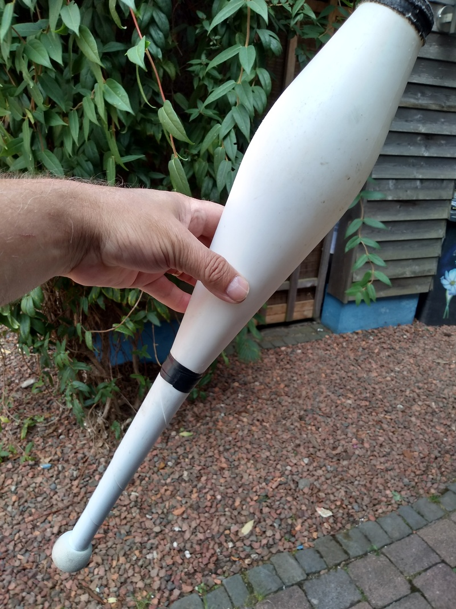
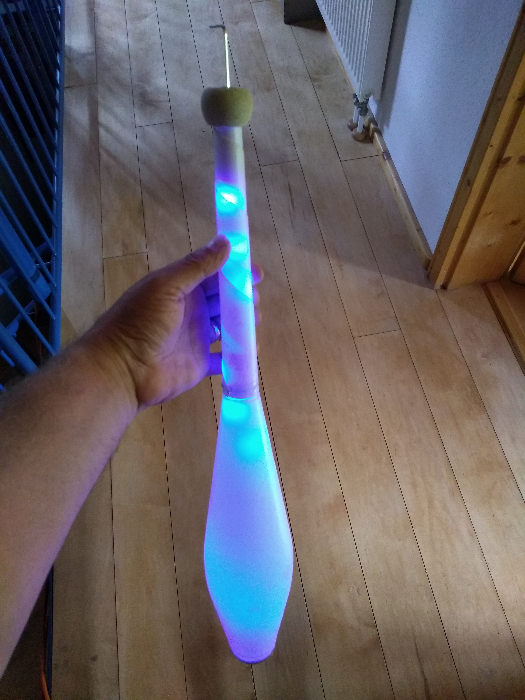

# DIY-LED-Clubs

Do It Yourself - Making LED-Clubs out of existing normal white juggeling clubs

For 3 clubs we need: Jugggeling Clubs, I have old clubs that I bought a few years ago from Mr. Oddball at a convention in the Netherlands for 10 € a piece.

3 Mini Switches: 5.88 (5 pices) https://www.amazon.de/gp/product/B00XA3RDQI/ref=ppx_yo_dt_b_asin_title_o00_s00?ie=UTF8&psc=1

3 Connectors 6.99 € (20 pcs) https://www.amazon.de/gp/product/B06WGM9W7S/ref=ppx_yo_dt_b_asin_title_o01_s00?ie=UTF8&psc=1

3x50cm Acryl Tube 16/12 12 € (2x1m) https://www.amazon.de/gp/product/B00A9HCFDY/ref=ppx_yo_dt_b_asin_title_o08_s00?ie=UTF8&psc=1

1A 5V Micro USB Charger: 6.99 € (5 pieces) https://www.amazon.de/gp/product/B077XW1XBJ/ref=ppx_yo_dt_b_asin_title_o09_s00?ie=UTF8&psc=1

LED Stripes: 32 € (4 pieces) https://www.amazon.de/gp/your-account/order-history/ref=ppx_yo_dt_b_pagination_1_2?ie=UTF8&orderFilter=months-6&search=&startIndex=10

3 Li-Ion Accu 10180: 36 € https://www.amazon.de/Li-ion-Schutzelektronik-passend-UC02SS-Taschenlampe/dp/B01MY8R3TH/ref=sr_1_1?__mk_de_DE=%C3%85M%C3%85%C5%BD%C3%95%C3%91&dchild=1&keywords=fenix+akku+10180&qid=1598276226&sr=8-1

In total these are +- 111 € for 3 Clubs

More to come
