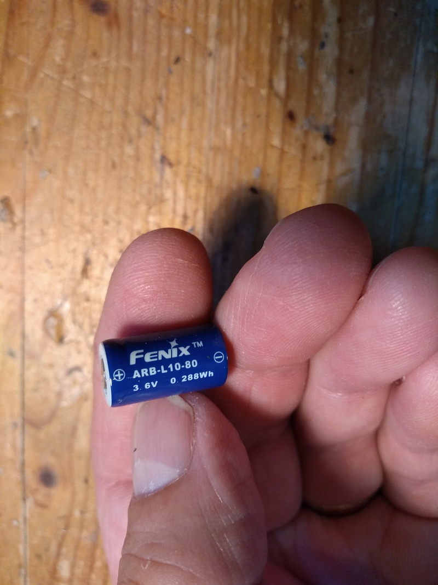
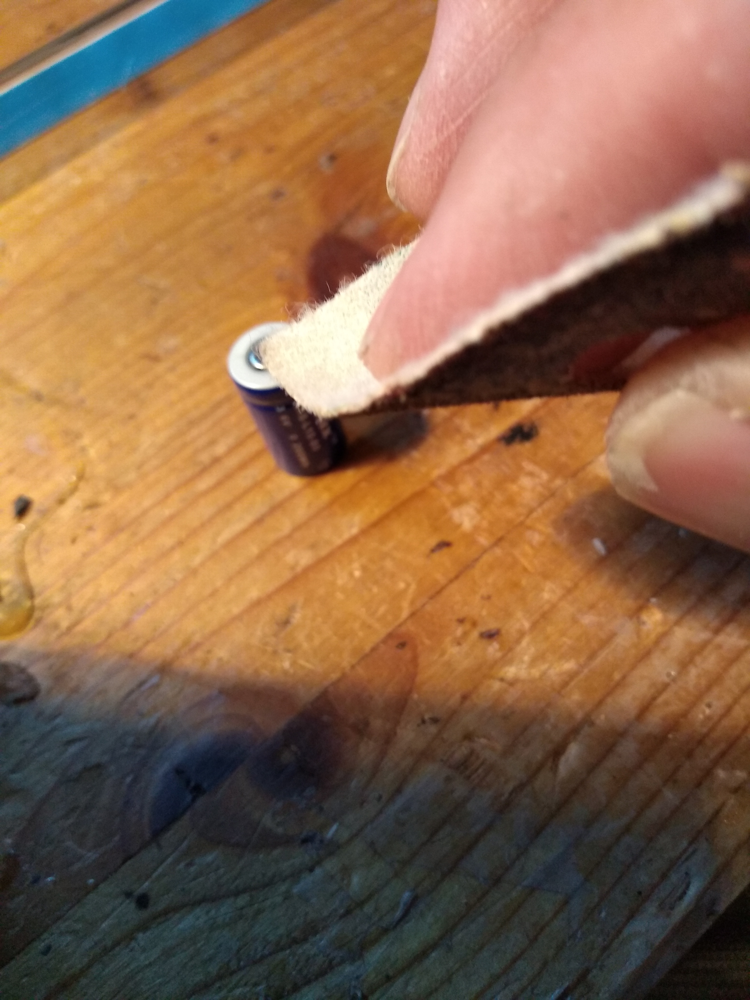
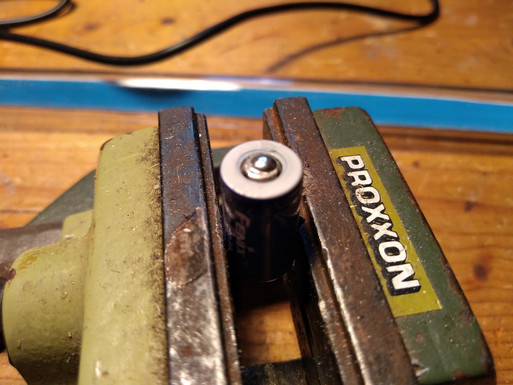
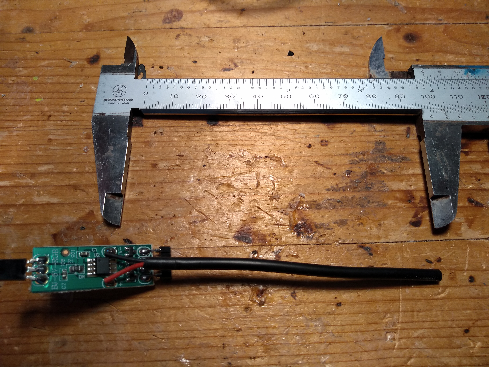
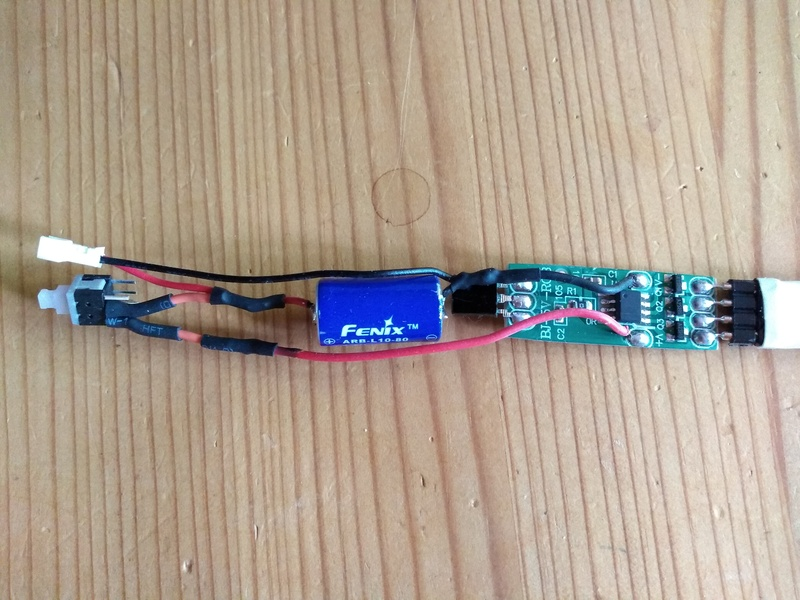
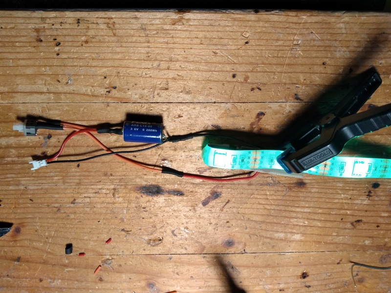

# DIY-LED-Clubs

Do It Yourself - Making LED-Clubs out of existing normal white juggeling clubs

For 3 clubs we need: Jugggeling Clubs, I have old clubs that I bought a few years ago from Mr. Oddball at a convention in the Netherlands for 10 € a piece.

3 Mini Switches: 5.88 (5 pices) https://www.amazon.de/gp/product/B00XA3RDQI/ref=ppx_yo_dt_b_asin_title_o00_s00?ie=UTF8&psc=1

3 Connectors: 6.99 € (20 pcs) https://www.amazon.de/gp/product/B06WGM9W7S/ref=ppx_yo_dt_b_asin_title_o01_s00?ie=UTF8&psc=1

3x50cm Acryl Tube 16/12: 12 € (2x1m) https://www.amazon.de/gp/product/B00A9HCFDY/ref=ppx_yo_dt_b_asin_title_o08_s00?ie=UTF8&psc=1

1A 5V Micro USB Charger: 6.99 € (5 pieces) https://www.amazon.de/gp/product/B077XW1XBJ/ref=ppx_yo_dt_b_asin_title_o09_s00?ie=UTF8&psc=1

LED Stripes: 32 € (4 pieces) https://www.amazon.de/gp/your-account/order-history/ref=ppx_yo_dt_b_pagination_1_2?ie=UTF8&orderFilter=months-6&search=&startIndex=10

3 Li-Ion battery 10180: 36 € https://www.amazon.de/Li-ion-Schutzelektronik-passend-UC02SS-Taschenlampe/dp/B01MY8R3TH/ref=sr_1_1?__mk_de_DE=%C3%85M%C3%85%C5%BD%C3%95%C3%91&dchild=1&keywords=fenix+akku+10180&qid=1598276226&sr=8-1

In total these are +- 111 € for 3 Clubs

Solder the wires to the Li-Ion battery 

Roughen the surface for quick soldering 

Prepare the LED controller 

Connect the battery, connector, switch and controller as shown 

The switch need some extra space 

"Fold" the strip and put it into the tube 

Ready for get hot glued 

Hot glued top, just stick 5-7 mm glue stick in it to fix the strip 

A 4 mm dowel for mounting the knob later  

Knob end parts fixed with tinkers friend hotglue 

Now we take apart our club to replace the wooden stick with the electrified tube 

Remove the clamps and take out the wooden stick 

Replacing 

Fix it with 2 clamps 

And tape it 

I charge it via the little connector. If you are using the same charger I use don't forget to replace the resistor, with the original resistor you charge with one ampere, this is too much for the small battery. I use R3=10 K. 

You have to take off the knob for charging! To switch on and off you can put a thin pin through a small drilled hole in the knob.
You have to disconnect the battery when the clubs are not in use from the power circuit, because even if the controller is switched off, the circuit consumes a small amount of current and drains the battery.

Thats it. 

Links: 
https://www.youtube.com/watch?v=mahqadb1gAk
